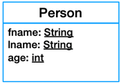
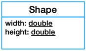

## [Lesson01](index.md) > Exercise03:

1. Open class [App](../../app/src/main/java/org/dii/oop/App.java) in package `org.dii.oop.App` and edit the code as display below:
   ```
   package org.dii.oop;

   import org.dii.oop.lesson01.exercise03.Lesson;

   public class App {
     public static void main(String[] args) {
       Lesson lesson = new Lesson();
       lesson.start();
    }
   }
   ```

2. Create class [Person](../../app/src/main/java/org/dii/oop/lesson01/exercise03/Person.java) and [Shape](../../app/src/main/java/org/dii/oop/lesson01/exercise03/Shape.java) and place it in the package `org.dii.oop.lesson01.exercise03` (You have to define all attributes as shown in the diagram):
   
    


3. Edit the method `displayPerson()` and `displayShape()` of class [Lesson](../../app/src/main/java/org/dii/oop/lesson01/exercise03/Lesson.java) in package `org.dii.oop.lesson01.exercise03` to display the output as shown below:
```
> Task :app:run
Output:
Name:John Doe
Age:24

Output:
Width:100
Height:200
```
