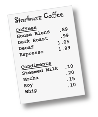

## [Lesson01](index.md) > Exercise05:

1. Open class [App](../../app/src/main/java/org/dii/oop/App.java) in package `org.dii.oop.App` and edit the code as display below:
   ```
   package org.dii.oop;

   import org.dii.oop.lesson01.exercise04.Lesson;

   public class App {
     public static void main(String[] args) {
       Lesson.run();
    }
   }
   ```

2. Edit class [Lesson](../../app/src/main/java/org/dii/oop/lesson01/exercise05/Lesson.java) in package `org.dii.oop.lesson01.exercise05` and follow the instructions below:
   * The Starbuzz is a coffee shop have the menu as shown below:
   
     
   
   * Design and create the coffee class for Startbuzz shop.
   * Test and create class instances of your design classes.
     
