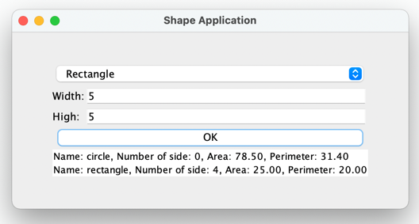

## [Lesson06](index.md) > Exercise02:
Challenge exercise: (No points)

1. Open class [App](../../app/src/main/java/org/dii/oop/App.java) in package `org.dii.oop.App` and edit the code as display below: 
   ```
   package org.dii.oop;

   import org.dii.oop.lesson06.exercise02.Lesson;

   public class App {
     public static void main(String[] args) {
       lesson.run();
    }
   }
   ```

2. Edit class [Lesson](../../app/src/main/java/org/dii/oop/lesson06/exercise02/Lesson.java) in package `org.dii.oop.lesson06.exercise02` and follow the instructions below:
   - Complete the `Shape Application`


3. The output of the program:
   
   
   