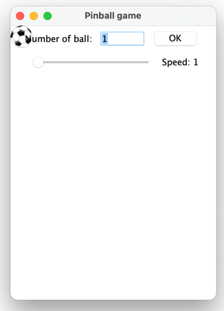
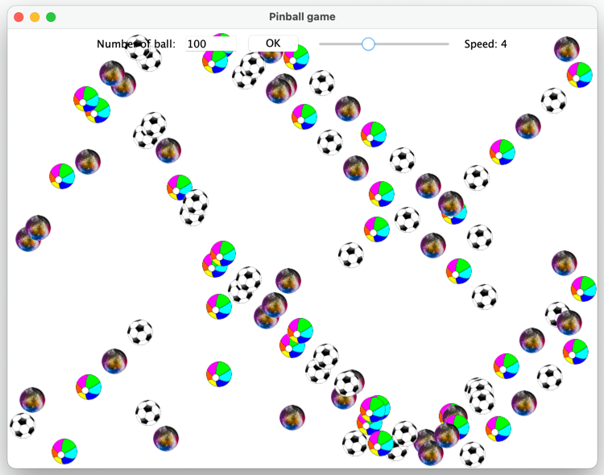

## [Lesson07](index.md) > Exercise01: Pinball game

Make the ball bounce left and right on the border of window frame.

1. Open class [App](../../app/src/main/java/org/dii/oop/App.java) in package `org.dii.oop.App` and edit the code as display below: 
   ```
   package org.dii.oop;

   import org.dii.oop.lesson06.exercise01.Lesson;

   public class App {
     public static void main(String[] args) {
       lesson.run();
    }
   }
   ```

2. Edit class [Lesson](../../app/src/main/java/org/dii/oop/lesson07/exercise01/Lesson.java) in package `org.dii.oop.lesson07.exercise01` and follow the instructions below:
   - The Pinball game is the GUI application in Java as shown below: 
     
     

     Note: we do not dig into all frameworks of GUI application development, we will use some classes of Swing framework to make more understand our objective of the OOP concept.
   - The `javax.swing.JFrame` class is a type of container which inherits the `java.awt.Frame` class. JFrame works like the main window where components like labels, buttons, textfields are added to create a GUI.
   - In our Pinball application, we created `org.dii.oop.lesson07.exercise01.PinballApp` class extends the `javax.swing.JFrame` class which inherit all parent behavior class, so we do not write all code to manage GUI applications just write the code needed for our program.
   - The `javax.swing.JPanel` class is a container that can store a group of components. The main task of JPanel is to organize components, various layouts can be set in JPanel which provides a better organization of components.
   - In our Pinball application, we created `org.dii.oop.lesson07.exercise01.BackgroundPanel` class extends the `javax.swing.JPanel` class which inherit all parent behavior classes and we use this panel to draw the ball image. 
   - **_The task is to use your knowledge of OOP to understand the code program and modify to the game to do more requirements._**

3. More requirements:
   - Add more type of ball `images/img2.png` and `images/img3.png`.
   - When the user types a number in TextField and then presses the OK button, the program should display the balls according to the typed number in the JPanel bounce around the region of the program.
   - Each ball appears at a random position within the boundary of the program.
   - Adjusting the `JSlider` control () will change the speed of all balls.

     
   