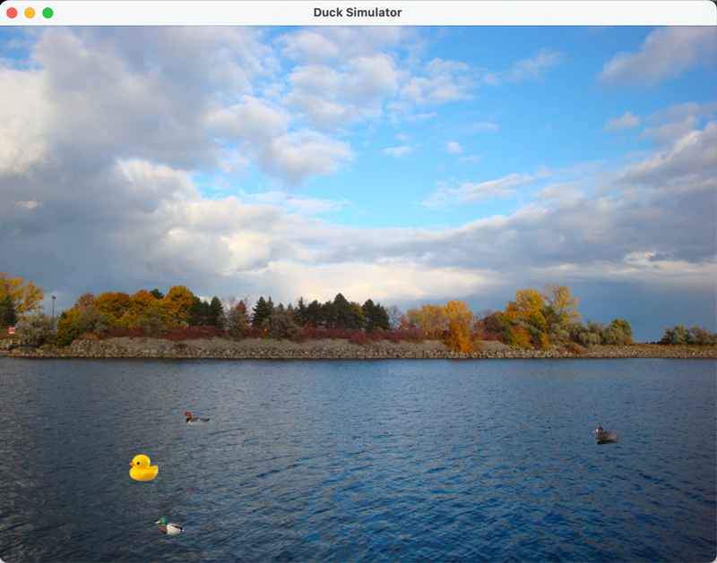

## [Lesson08](index.md) > Exercise03

1. Open class [App](../../app/src/main/java/org/dii/oop/App.java) in package `org.dii.oop.App` and edit the code as display below: 
   ```
   package org.dii.oop;

   import org.dii.oop.lesson08.exercise02.Lesson;

   public class App {
     public static void main(String[] args) {
       lesson.run();
    }
   }
   ```

2. Edit class [Lesson](../../app/src/main/java/org/dii/oop/lesson08/exercise02/Lesson.java) in package `org.dii.oop.lesson08.exercise02` and follow the instructions below:
   - From the previous `exercise02`, create a GUI SimUDuck application by applying your design classes and the images in [`images`](../../app/src/main/resources/org/dii/oop/images) to draw the duck.
   - From the previous exercise, you draw the ball image around the boundary window, in this exercise, you have to draw the duck image according to the species using your designed classes. 

3. The running output of the SimUDuck game is shown below.

   
   