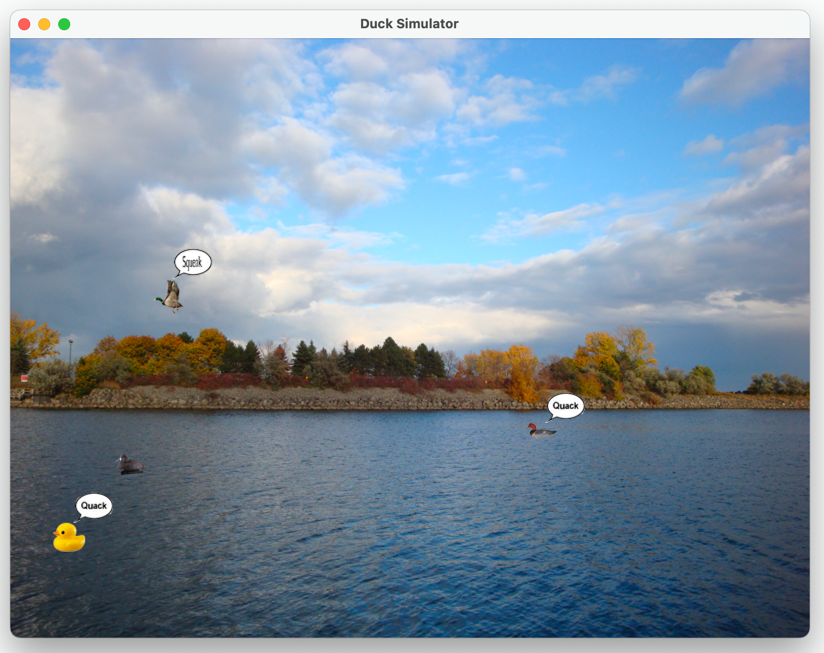

## [Lesson09](index.md) > Exercise02

1. Open class [App](../../app/src/main/java/org/dii/oop/App.java) in package `org.dii.oop.App` and edit the code as display below: 
   ```
   package org.dii.oop;

   import org.dii.oop.lesson09.exercise01.Lesson;

   public class App {
     public static void main(String[] args) {
       lesson.run();
    }
   }
   ```

2. Edit class [Lesson](../../app/src/main/java/org/dii/oop/lesson09/exercise02/Lesson.java) in package `org.dii.oop.lesson09.exercise02` and follow the instructions below:
   - Update the SimUDuck game with the requirements below:
     1. The duck species that can't fly can swim only in the water region.
     2. The duck species that can fly use the fly image version to draw and can fly all regions of the image background.
     3. The duck species that can sound say quack when they bounce the left or right edge.
     4. The duck species that can fly will fly when they bounce the bottom edge.
   - Run the code:
   
     